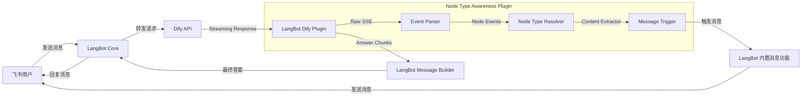
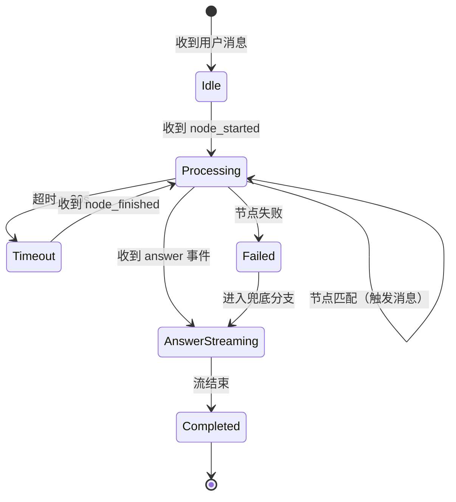

# LangBot-Dify 工作流节点直接输出插件需求文档

**版本**: v1.1  
**日期**: 2026-07-16  
**状态**: 已更新（根据节点类型直接输出需求修改）

---

## 1. 项目概述

### 1.1 背景

当前 LangBot 作为 Dify 与飞书的中转层，仅能将 Dify 工作流的最终答案以流式打字机效果回传飞书。用户在长耗时工作流执行期间（如 Confluence 文档检索聚合），无法感知当前处理阶段，导致等待焦虑与重复提问。

### 1.2 目标

开发 LangBot 自定义插件，使其具备**工作流节点类型感知能力**：

- 监听 Dify Streaming API 中的工作流节点生命周期事件
- 根据节点类型（如 `direct_output`）决定是否触发消息通过 LangBot 的内置功能
- 通过 LangBot 的内置消息功能展示节点的实际输出内容
- 异常场景下降级为静默执行，不阻断主流程

### 1.3 范围

| 在范围内 | 不在范围内 |
|---------|-----------|
| LangBot 插件层二次开发 | Dify 工作流本身的逻辑修改 |
| Dify Streaming 事件消费与解析 | 飞书机器人基础消息收发（已存在） |
| 消息内容获取及触发（基于节点内容） | 飞书卡片 UI 设计（使用 LangBot 内置消息功能） |
| 节点类型匹配配置化 | Dify 引擎内部节点调度优化 |

---

## 2. 术语与引用

| 术语 | 定义 |
|------|------|
| **Node Type** | Dify 节点的类型字段（`node_type`），如 `llm`, `agent`, `direct_output` 等 |
| **Node Event** | Dify Streaming API 推送的 `workflow_node_started` / `workflow_node_finished` 事件 |
| **Node Type Config** | 配置文件中声明哪些节点类型应触发消息通过 LangBot 的内置功能 |

### 2.1 引用文档

- [Dify API - Streaming Mode 事件类型](https://docs.dify.ai/guides/application-publishing/developing-with-apis)
- [LangBot 插件开发文档](https://docs.langbot.app/plugin)
- [LangBot 消息接口文档](https://docs.langbot.app/plugin/messaging)

---

## 3. 功能需求

### 3.1 节点类型匹配配置（FR-01）

**描述**: 插件需支持通过配置文件定义哪些 Dify 节点类型应向飞书推送其内容（如 `direct_output`）。配置采用 YAML 格式，便于修改。

**输入**: YAML 配置文件 `node_type_config.yml`

```yaml
# node_type_config.yml
workflow_id: "confluence-chat"          # 可选：用于过滤特定工作流（若为空则匹配所有工作流）
node_types:
  - direct_output                       # 直接输出节点，需触发消息展示其内容
  - llm                                 # 例如也想触发消息展示 LLM 节点的输出（可选）
```

**验收标准**:

- [ ] 插件启动时加载配置并校验格式  
- [ ] 支持通过 `node_type` 字段匹配配置中的类型  
- [ ] 未匹配节点不触发消息（静默处理）  
- [ ] 支持热重载或重启生效  

---

### 3.2 Dify 事件流监听（FR-02）

**描述**: 插件需在 LangBot 转发 Dify 请求时，建立独立的事件消费通道，解析工作流节点事件。

**Dify Streaming 事件结构**（关键字段）：

```json
{
  "event": "workflow_node_started",
  "workflow_run_id": "xxx",
  "data": {
    "id": "node123",
    "title": "直接输出",
    "node_type": "direct_output",
    "inputs": {...},
    "outputs": {...},
    "created_at": 1721123456
  }
}
```

```json
{
  "event": "workflow_node_finished",
  "workflow_run_id": "xxx",
  "data": {
    "id": "node123",
    "title": "直接输出",
    "node_type": "direct_output",
    "outputs": {...},
    "elapsed_time": 12.34,
    "status": "succeeded"
  }
}
```

**验收标准**:

- [ ] 正确解析 `workflow_node_started` 和 `workflow_node_finished` 事件  
- [ ] 忽略非工作流相关事件（如 `message`、`agent_message`）  
- [ ] 同一 `workflow_run_id` 的事件需归组到同一会话  
- [ ] 事件解析失败不阻断答案流式输出  

---

### 3.3 消息触发（FR-03）

**描述**: 当检测到节点类型匹配配置中的类型（如 `direct_output`）时，插件提取该节点的内容（优先使用 `outputs`，若无则使用 `inputs`），并通过 LangBot 的内置消息功能触发消息发送，展示该内容。

**消息触发示例**（消息内容）：

```json
{
  "message": "**节点输出**：\n\n这是节点的具体内容……",
  "msgtype": "markdown",
  "workflow_run_id": "xxx",
  "node_type": "direct_output"
}
```

**触发方式**: 通过 LangBot 插件接口调用内置消息发送功能。

**验收标准**:

- [ ] 节点类型匹配时消息在 1 秒内触发发送
- [ ] 支持提取节点 `outputs`（优先）或 `inputs` 作为消息内容
- [ ] 同一 `workflow_run_id` 的消息使用相同的工作流运行 ID 进行关联
- [ ] 触发失败重试 3 次，仍失败则放弃并记录日志
- [ ] 若节点类型不在配置中，则不触发消息（保持静默）  

---

### 3.4 节点超时与失败降级（FR-04）

**描述**: 当节点执行超时或失败时，插件需给出明确提示，并允许工作流继续执行。

**场景定义**:

| 场景 | 行为 |
|------|------|
| 节点执行中超过 30 秒 | 卡片状态变为 "⏳ 处理中（耗时较长，请耐心等待）" |
| 节点执行失败（status=failed） | 卡片显示 "⚠️ 某节点处理异常，正在尝试后续方案..." |
| Dify 事件流中断 | 卡片显示 "⏳ 连接不稳定，正在获取结果..." |
| 飞书 API 限流（429） | 指数退避重试，最大间隔 8 秒 |

**验收标准**:

- [ ] 超时检测精度 ±2 秒  
- [ ] 失败提示不暴露内部错误详情  
- [ ] 所有降级路径最终仍需展示最终答案  

---

### 3.5 最终答案聚合（FR-05）

**描述**: 工作流完成后，插件需将最终答案以打字机效果输出，并更新卡片为完成状态。

**验收标准**:

- [ ] 最终答案正常流式输出不受节点更新影响  
- [ ] 卡片最终状态显示 "✅ 完成" 并收起额外内容（仅保留标题）  
- [ ] 保留引用文档链接等原始格式  

---

## 4. 非功能需求

### 4.1 性能

- 节点切换感知延迟 ≤ 500ms（从 Dify 推送事件到消息触发）
- 插件自身处理吞吐量 ≥ 50 事件/秒
- 不增加 Dify 工作流端到端耗时

### 4.2 稳定性

- 插件异常不得阻断 LangBot 主消息链路
- 消息触发失败不得影响最终答案输出
- 支持优雅降级：消息功能不可用时回退到日志记录

### 4.3 兼容性

- Dify 版本: 1.15.0+
- LangBot 版本: 需确认当前版本，建议 3.x+
- 消息接口: LangBot 插件消息 API v1

### 4.4 可观测性

- 所有节点类型匹配与超时/失败事件记录结构化日志（JSON 格式）
- 关键指标暴露 Prometheus 指标：
  - `langbot_dify_node_match_total`（匹配节点数量）
  - `langbot_dify_node_latency_seconds`（节点处理延迟）
  - `langbot_message_trigger_errors_total`（消息触发失败次数）

---

## 5. 技术架构

### 5.1 组件图



### 5.2 状态机



---

## 6. 接口设计

### 6.1 插件配置接口

```python
# config.py
from dataclasses import dataclass, field
from typing import List, Optional

@dataclass
class NodeTypeConfig:
    workflow_id: Optional[str] = None   # 若为空则匹配所有工作流
    node_types: List[str] = field(default_factory=list)  # 需要匹配的节点类型列表

@dataclass
class PluginConfig:
    node_type_config: NodeTypeConfig
    # 移除 Feishu 特定配置，消息发送通过 LangBot 内置功能
    enable_metrics: bool = True

    def __post_init__(self):
        if not self.node_type_config.node_types:
            raise ValueError("node_types must not be empty")
```

### 6.2 核心类设计

#### Event Parser（event_parser.py）

```python
# 与之前相同，解析为 NodeStartedEvent / NodeFinishedEvent，包含 node_type 字段
```

#### Node Type Resolver（node_type_resolver.py）

```python
from typing import Optional
from .config import NodeTypeConfig

class NodeTypeResolver:
    def __init__(self, config: NodeTypeConfig):
        self.config = config

    def is_matching_node(self, node_type: str, workflow_id: Optional[str] = None) -> bool:
        """根据配置判断节点是否应触发消息"""
        if self.config.workflow_id and workflow_id != self.config.workflow_id:
            return False
        return node_type in self.config.node_types
```

#### Content Extractor（content_extractor.py）

```python
from typing import Dict, Any, Optional

class ContentExtractor:
    @staticmethod
    def extract_content(event_data: Dict[str, Any]) -> Optional[str]:
        """
        从节点事件中提取要处理的内容。
        优先使用 outputs，若无则使用 inputs；将其转换为可读字符串。
        """
        data = event_data.get("data", {})
        # 优先取 outputs
        content = data.get("outputs")
        if content is None:
            content = data.get("inputs")
        if content is None:
            return None
        # 简单转换为 JSON 字符串（可根据实际需求自定义）
        import json
        try:
            return json.dumps(content, ensure_ascii=False, indent=2)
        except Exception:
            return str(content)
```

#### Message Trigger（message_trigger.py）

```python
import logging
from typing import Optional

logger = logging.getLogger(__name__)

class MessageTrigger:
    """Triggers messages through LangBot's built-in functionality."""
    
    def __init__(self):
        # In a real implementation, this would initialize connection to LangBot's messaging API
        pass
        
    def trigger_message(self, content: str, node_type: str, workflow_run_id: str) -> bool:
        """
        Trigger a message through LangBot's built-in functionality.
        
        Args:
            content: The extracted content to send
            node_type: The type of node that generated the content
            workflow_run_id: The workflow run ID for tracking
            
        Returns:
            True if triggered successfully, False otherwise
        """
        try:
            # In a real implementation, this would call into LangBot's messaging API
            # For demonstration, we log what would be sent
            logger.info(
                f"Triggering message for workflow {workflow_run_id}: "
                f"node_type={node_type}, content_length={len(content)}"
            )
            
            # Example of what the actual implementation might do:
            # langbot_messaging.send_message(
            #     content=f"[Node Type: {node_type}]\n{content}",
            #     metadata={"workflow_run_id": workflow_run_id, "node_type": node_type}
            # )
            
            return True
        except Exception as e:
            logger.error(f"Failed to trigger message: {e}", exc_info=True)
            return False
```

#### 主插件（plugin.py）

```python
"""LangBot Dify Node Type Awareness Plugin - Main Plugin Interface."""

import logging
import time
from typing import Optional
from .config import PluginConfig
from .event_parser import EventParser, NodeStartedEvent, NodeFinishedEvent
from .node_type_resolver import NodeTypeResolver
from .content_extractor import ContentExtractor
from .message_trigger import MessageTrigger

logger = logging.getLogger(__name__)


class NodeTypeAwarenessPlugin:
    """
    Main plugin class for LangBot Dify Node Type Awareness functionality.
    The plugin focuses on message content acquisition and triggering,
    while message sending is handled by LangBot's built-in functionality.
    """

    def __init__(self, config: PluginConfig):
        self.config = config
        self.event_parser = EventParser()
        self.resolver = NodeTypeResolver(config.node_type_config)
        self.extractor = ContentExtractor()
        self.message_trigger = MessageTrigger()
        self.logger = logging.getLogger(__name__ + ".NodeTypeAwarenessPlugin")
        self.is_enabled = True
        self.node_start_times: dict[str, float] = {}   # workflow_run_id -> start time

    # ------------------- Public API -------------------

    def process_dify_event(self, event_data: str) -> bool:
        """
        Process a single Dify streaming event.

        Returns:
            True if processed successfully, False on unrecoverable error.
        """
        if not self.is_enabled:
            return False

        try:
            event = self.event_parser.parse_event(event_data)
            if not event:
                return True   # ignore non‑relevant events

            if isinstance(event, NodeStartedEvent):
                self._handle_node_started(event)
                return True
            elif isinstance(event, NodeFinishedEvent):
                self._handle_node_finished(event)
                return True
            else:
                return True
        except Exception as e:
            self.logger.error(f"Error processing Dify event: {e}", exc_info=True)
            return False

    # ------------------- Internal handlers -------------------
    def _handle_node_started(self, event: NodeStartedEvent) -> None:
        """Record start time for timeout detection."""
        self.node_start_times[event.workflow_run_id] = time.time()
        self._maybe_trigger_message(event)

    def _handle_node_finished(self, event: NodeFinishedEvent) -> None:
        """Clear start time and possibly trigger message (for failure case)."""
        self.node_start_times.pop(event.workflow_run_id, None)
        self._maybe_trigger_message(event)

    # ------------------- Message trigger logic -------------------
    def _maybe_trigger_message(self, event) -> None:
        """Decide whether to trigger a message based on the event."""
        try:
            # Determine if we need to show timeout/failure first
            content_to_send = None
            wr_id = event.workflow_run_id

            # Timeout detection (only for started events; for finished we rely on status)
            if isinstance(event, NodeStartedEvent):
                start = self.node_start_times.get(wr_id)
                if start and (time.time() - start) > 30.0:
                    # Timeout case - send a special message
                    content_to_send = f"⏳ 处理中（耗时较长，请耐心等待）\n\n节点：{event.node_title}"

            # Failure detection (status == finished)
            if content_to_send is None and isinstance(event, NodeFinishedEvent):
                if event.status == "failed":
                    # Failure case - send a special message
                    content_to_send = f"⚠️ 某节点处理异常\n\n节点：{event.node_title}\n状态：{event.status}"

            # Normal matching node type
            if content_to_send is None:
                if self.resolver.is_matching(event.node_type, wr_id):
                    content = self.extractor.extract(event.__dict__)
                    if content:
                        content_to_send = f"**节点类型**：{event.node_type}\n\n**内容**：\n{content}"

            # If still nothing, we do nothing (silent)
            if content_to_send is None:
                return

            # Send message through LangBot's built-in functionality
            if self.message_trigger.trigger_message(
                content=content_to_send,
                node_type=event.node_type,
                workflow_run_id=wr_id
            ):
                self.logger.info(f"Successfully triggered message for workflow {wr_id}")
            else:
                self.logger.warning(f"Failed to trigger message for workflow {wr_id}")

        except Exception as e:
            self.logger.error(f"Error triggering message: {e}", exc_info=True)

    # ------------------- Lifecycle -------------------
    def enable(self) -> None:
        self.is_enabled = True
        self.logger.info("Node type awareness plugin enabled")

    def disable(self) -> None:
        self.is_enabled = False
        self.logger.info("Node type awareness plugin disabled")

    def get_status(self) -> dict:
        return {
            "enabled": self.is_enabled,
            "workflow_id": self.config.node_type_config.workflow_id,
            "configured_node_types": self.config.node_type_config.node_types,
        }


# Factory function
def create_plugin_from_config(config_dict: dict) -> NodeTypeAwarenessPlugin:
    from .config import PluginConfig, NodeTypeConfig

    node_cfg = NodeTypeConfig(
        workflow_id=config_dict.get("workflow_id"),
        node_types=config_dict.get("node_types", []),
    )
    cfg = PluginConfig(
        node_type_config=node_cfg,
        enable_metrics=config_dict.get("enable_metrics", True),
    )
    return NodeTypeAwarenessPlugin(cfg)
```

---

## 7. 数据流

### 7.1 正常流程（匹配节点类型）

```
用户提问
  ↓
LangBot 调用 Dify API (streaming)
  ↓
Dify 推送 workflow_node_started (node_type=direct_output)
  ↓
Event Parser 解析为 NodeStartedEvent
  ↓
Node Type Resolver 判断为匹配节点
  ↓
Content Extractor 提取节点 outputs/inputs 内容
  ↓
Message Trigger 触发消息通过 LangBot 内置功能
  ↓
LangBot 内置消息功能发送节点内容
  ↓
...（后续节点同上）
  ↓
Dify 推送最终 answer
  ↓
LangBot 流式输出答案
```

### 7.2 异常流程（超时/失败）

```
用户提问
  ↓
LangBot 调用 Dify API (streaming)
  ↓
Dify 推送 workflow_node_started (node_type=xxx)
  ↓
若 30s 内未触发消息 → 触发超时提示消息
  ↓
最终收到 node_finished (status=failed)
  ↓
触发失败提示消息
  ↓
工作流进入兜底分支 → 最终输出兜底答案
```

---

## 8. 异常处理策略

| 异常场景 | 检测方式 | 处理策略 | 日志级别 |
|----------|----------|----------|----------|
| Dify SSE 连接断开 | 心跳超时 60s | 标记状态为 `connection_lost`，提示"连接不稳定" | ERROR |
| 节点执行失败 | `status=failed` | 提示异常，继续监听后续事件 | WARNING |
| 消息触发失败 | 触发返回 false | 重试 3 次后放弃 | WARNING |
| 配置加载失败 | YAML 解析异常 | 插件禁用，回退到原始 LangBot 行为 | CRITICAL |
| 未匹配节点类型 | 配置中未命中 | 静默忽略，不触发消息 | DEBUG |

---

## 9. 验收标准

### 9.1 功能验收

| 用例 ID | 场景 | 预期结果 | 优先级 |
|---------|------|---------|--------|
| TC-01 | 用户提问"证书监控方案"（包含 direct_output 节点） | 消息实时触发发送该节点的内容，最终答案正常输出 | P0 |
| TC-02 | 用户提问"空间树"（无匹配节点类型） | 未触发消息，仅最终答案输出 | P0 |
| TC-03 | 某匹配节点执行 40 秒 | 30 秒时触发超时提示消息，完成后正常结束 | P1 |
| TC-04 | 匹配节点执行失败 | 触发失败提示消息，最终输出兜底答案 | P1 |
| TC-05 | 消息触发限流 | 消息触发延迟但最终成功，日志记录退避过程 | P2 |

### 9.2 性能验收

- 节点切换延迟 ≤ 500ms（100 次测试，P99）
- 插件 CPU 占用 < 5%（单核）
- 内存占用 < 128MB

---

## 10. 排期与里程碑

| 里程碑 | 交付物 | 预计工时 | 截止日期 |
|--------|--------|---------|---------|
| M1: 需求冻结 | 本 PRD 定稿 + 技术方案评审 | 2 天 | T+2 |
| M2: 基础框架 | Event Parser + Node Type Resolver + 配置加载 | 2 天 | T+4 |
| M3: 消息触发实现 | Message Trigger + 内容提取 + 集成测试 | 3 天 | T+7 |
| M4: 异常处理 | 超时检测 + 降级策略 + 日志/指标 | 2 天 | T+9 |
| **总计** | | **9 天** | |

---

## 11. 风险与依赖

| 风险 | 影响 | 缓解措施 |
|------|------|----------|
| Dify Streaming API 事件格式变更 | 事件解析失败 | 增加字段存在性校验，格式变更时快速适配 |
| LangBot 插件接口不兼容 | 无法接入 | 开发前确认 LangBot 版本及插件 Hook 点 |
| 飞书 CardKit API 限流严格 | 卡片更新频繁被拒 | 增加本地状态缓存，合并短时间内多次更新 |
| Dify 1.15.0 工作流事件推送不完整 | 节点信息缺失 | 增加兜底：若长时间无事件，基于 answer 流推断节点输出 |

---

## 12. 附录

### 12.1 配置文件模板

见 FR-01 中的 `node_type_config.yml`。

### 12.2 日志格式示例

```json
{
  "timestamp": "2026-07-16T10:56:00+08:00",
  "level": "INFO",
  "workflow_run_id": "wr_abc123",
  "event": "node_matched",
  "node_type": "direct_output",
  "content_length": 1024,
  "latency_ms": 234,
  "card_id": "oc_xxx"
}
```

---

## 13. 文档签署

| 角色 | 姓名 | 日期 | 意见 |
|------|------|------|------|
| 产品负责人 | | | |
| 技术负责人 | | | |
| 测试负责人 | | | |